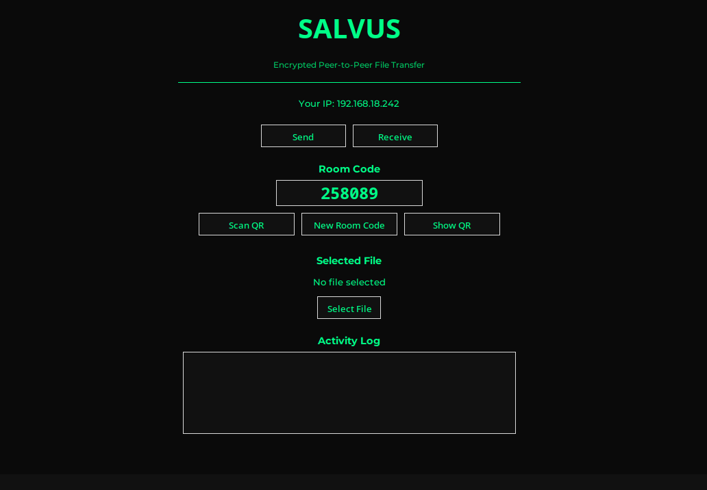
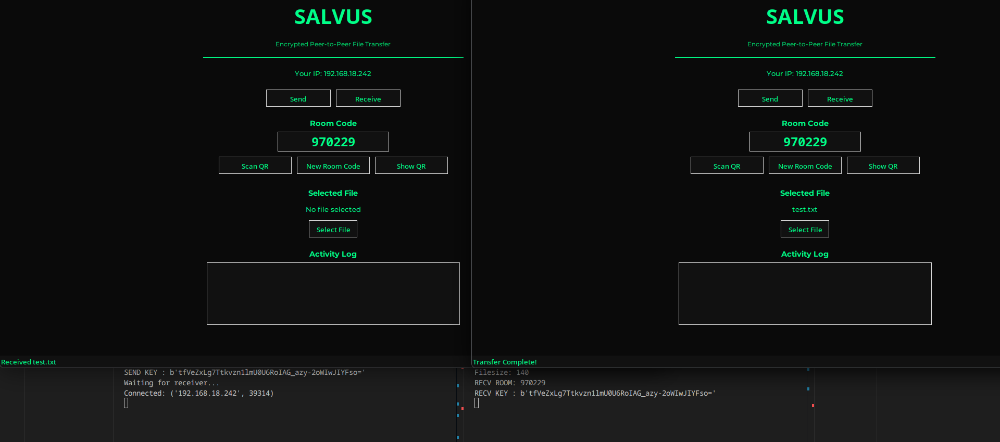

# SALVUS

Encrypted peer-to-peer file transfer with QR pairing and room-code authentication.

---

## Features

- End-to-end encrypted file transfer
- QR code pairing
- Room-code authentication
- Cyberpunk-inspired interface
- Activity logging
- Secure local network communication

---

## Main Interface



---

## QR Pairing


---
## Transfer



---

## Installation

```bash
git clone https://github.com/pelagornisandersi/SALVUS.git
pip install -r requirements.txt
python main.py
```

## Technologies Used

- Python
- Tkinter
- Cryptography (Fernet)
- QRCode
- Pillow
- Socket Programming
